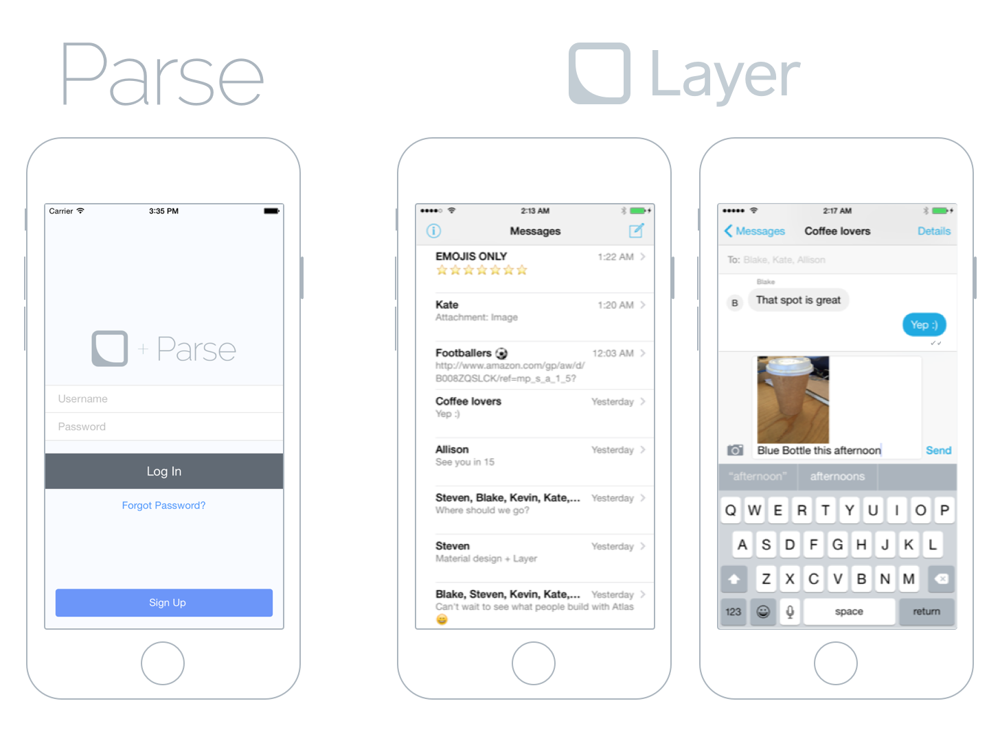

# Layer + Parse iOS Example (Swift)

This repository contains an example project that demonstrates how to implement an iOS chat application **in Swift** with messaging services provided by [Layer](https://layer.com), user interface components from [Atlas](https://github.com/layerhq/Atlas-iOS) and a user backend provided by [Parse](http://parse.com).

Here is the original project in Objective-C from [Layer](https://layer.com): [Layer-Parse-iOS-Example](https://github.com/layerhq/Layer-Parse-iOS-Example) 

## Requirements

This application requires Xcode 7 and the iOS SDK v9.0. Dependencies are managed via [CocoaPods](http://cocoapods.org/) to simplify installation.

## Setup

1. Clone the project from Github: `$ git clone https://github.com/layerhq/Layer-Parse-iOS-Swift-Example.git`
2. Install the dependencies in the root directory via CocoaPods: `$ pod install`
3. Open `Layer-Parse-iOS-Swift-Example.xcworkspace` in Xcode.
4. Replace `LayerAppIDString` , `ParseAppIDString` , and `ParseClientKeyString` in `AppDelegate.swift` with your Layer and Parse credentials.
5. Add the [Layer Parse Module](https://github.com/layerhq/layer-parse-module) to your Parse Cloud Code to serve as an authentication manager.
6. (Recommended) If you want test users, import the `Resources/Users.json` file into your User class on Parse.
7. Build and run the application on your Simulator to create a new user and begin messaging!

For more in-depth documentation about this project, check our [guide](https://developer.layer.com/docs/guides/ios#parse).

## Highlights

* Uses [ParseUI](https://github.com/ParsePlatform/ParseUI-iOS) to authenticate and create new users.
* Demonstrates how to get identity tokens from Parse Cloud Code using the [Layer Parse Cloud Module](https://github.com/layerhq/layer-parse-module)
* Uses [Atlas](https://atlas.layer.com), Layer's UI components

## Configuration

In order to populate the sample app with content, you must configure the following variable inside [AppDelegate.swift](Code/AppDelegate.swift):

* `LayerAppIDString`: The Layer application identifier for your application.
* `ParseAppIDString`: Your Parse App ID.
* `ParseClientKeyString`: Your Parse Client Key.

## Credits (original project Layer-Parse-iOS-Example)

This project was lovingly crafted in San Francisco. At Layer, we are building the full-stack building block for communications. We value, support, and create works of Open Source engineering excellence.

* [Abir Majumdar](http://github.com/maju6406)
* [Kabir Mahal](https://github.com/kmahal/)
* [Blake Watters](https://github.com/blakewatters)
* [Tomaž Štolfa](https://twitter.com/tomazstolfa)

## License

Layer-Parse-iOS-Swift-Example is available under the Apache 2 License. See the LICENSE file for more info.
